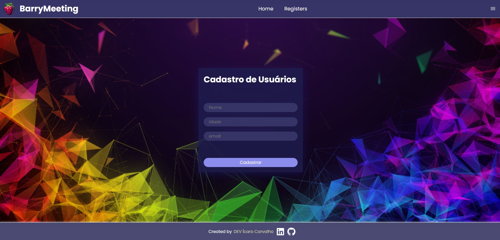

BarryMeeting – Cadastro de Usuários

Este é um projeto simples desenvolvido com React, Node.js e MongoDB, criado para demonstrar o fluxo básico de cadastro de usuários em uma aplicação fullstack moderna.

  

A interface apresenta um design limpo e colorido, com foco na experiência do usuário, permitindo cadastrar nome, idade e email de forma rápida e intuitiva.

🚀 Tecnologias Utilizadas
Frontend

React + Vite

CSS / Tailwind (opcional — ajuste conforme seu projeto)

Axios para requisições HTTP

Backend

Node.js

Express

MongoDB + Mongoose

📌 Funcionalidades

Cadastro de usuários com:

Nome

Idade

Email

Validação simples dos campos

Envio dos dados para o backend via API

Armazenamento no MongoDB

Layout responsivo e agradável

📁 Como rodar o projeto
🔧 1. Clone o repositório
git clone https://github.com/seu-usuario/seu-repositorio.git
cd seu-repositorio

🖥️ 2. Instale as dependências do frontend
cd frontend
npm install
npm run dev

⚙️ 3. Instale as dependências do backend
cd backend
npm install
npm start

🗄️ 4. Configure o MongoDB

No arquivo .env, adicione sua string de conexão:

MONGO_URI=mongodb+srv://...
PORT=5000

📚 Estrutura do Projeto
/frontend   → Interface React
/backend    → API Node.js com Express